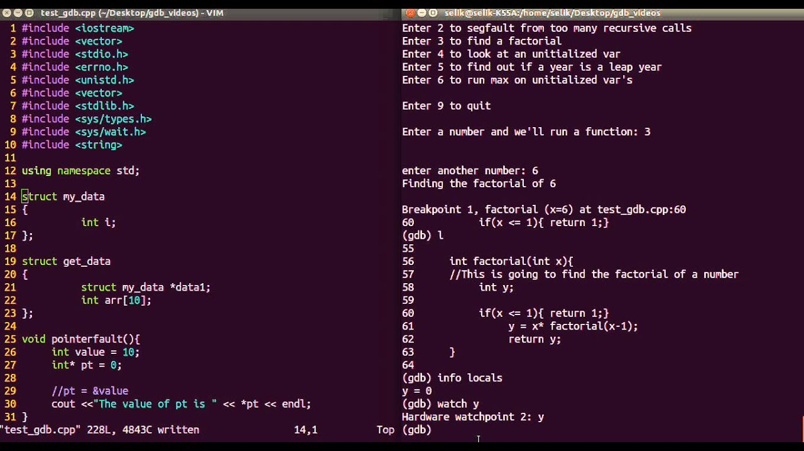

# Debugger

โดยปกติแล้วโปรแกรมเมอร์มักจะตรวจดู bug ต่างๆโดยดูค่าผ่านตัวแปร [1] แต่การมีของโปรแกรม debugger นั้นทำให้เราสามารถเข้าใจการทำงานของโปรแกรม และสามารถหาจุดบกพร่องของโปรแกรมได้ง่ายขึ้น โดยตัว debugger ที่เราจะพาไปรู้จักในวันนี้ จะเป็น GDB ซึ่งเป็นโปรแกรมที่สามารถทำงานบนระบบปฏิบัติการ Linux ได้นั่นเอง

**รูปที่ 1** แสดงหน้าต่างตัวอย่างการทำงานของ GDB [2]

## GDB

GDB หรือที่เรียกชื่อเต็มว่า GNU Compiler เป็น โปรแกรมตรวจแก้จุดบกพร่องที่พัฒนาโดยนักพัฒนา GNU Project ทำงานบนระบบปฏิบัติการยูนิกซ์ สนับสนุนภาษาต่างๆ เช่น ภาษาซี, ซีพลัสพลัส, เอดา, ฟอร์แทรน เป็นต้น [3]

เวลาเริ่มใช้ GDB จะมีลักษณะ syntax ดังนี้
- gdb *name-of-executable หรือชื่อไฟล์*

### คำสั่งที่ใช้กับ GDB

| คำสั่ง | ตัวย่อ | รายละเอียด | 
| -- |  --  |  --  |
| `run`     |   r    |เริ่มคำสั่งให้โปรแกรมทำงาน |
| `break`   |   b    |กำหนด breakpoint ให้กับโปรแกรม |
| `continue`| c      | ให้โปรแกรมทำงานจนจบหรือจนกว่าจะเจอ breakpoint ถัดไป |
| `step`    |   s    | ให้โปรแกรมทำในคำสั่งต่อไปทีละ 1 คำสั่ง |
| `list`    |   l    | แสดง *source code* ทั้งหมด                       |
| `quit`    |   q    |ออกจากโปรแกรม GDB |
| `kill`    |        | หยุดการทำงานโปรแกรมทันที
| `print` *variable* |   p *variable*    |สั่งให้พิมพ์ค่าที่เก็บไว้ในตัวแปร |

## Reference

https://thtutz.blogspot.com/2011/01/gdb.html [1]

https://www.youtube.com/watch?app=desktop&v=Yq6XFl-u00o [2] 

https://en.wikipedia.org/wiki/GNU_Debugger [3] 

   

