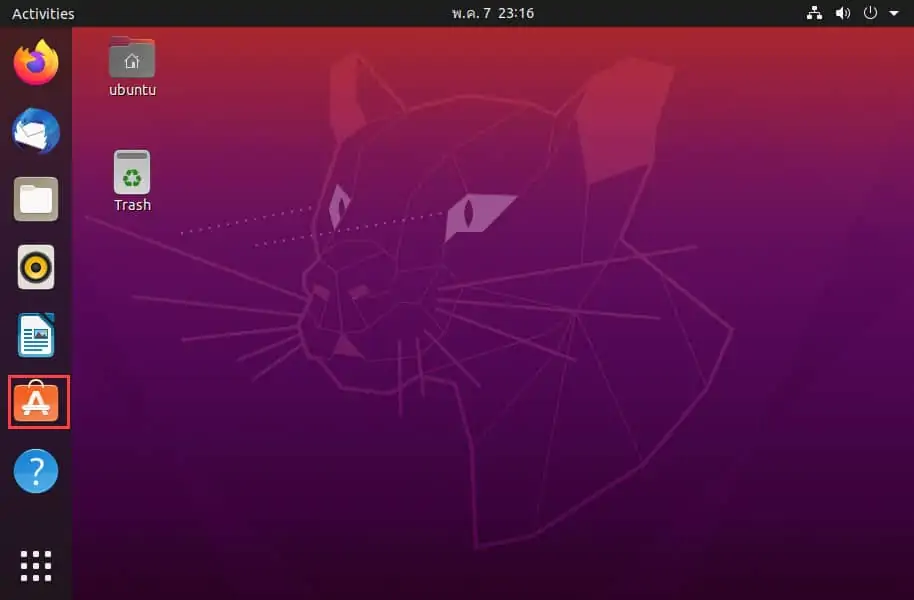
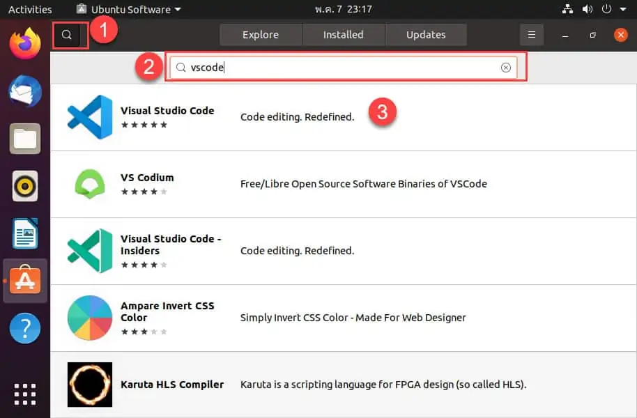
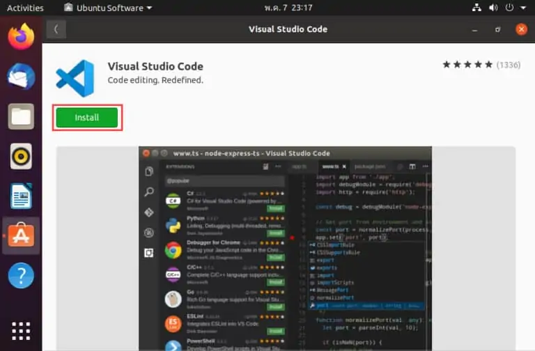
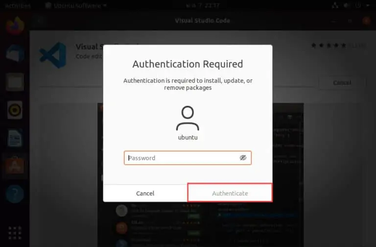

# Visual Studio Code

โปรแกรม Visual Code Studio เป็นโปรแกรม open source ที่ใช้สำหรับเขียนโค้ด พัฒนาแอปพลิเคชั่น แบบข้ามแพลตฟอร์ม และรองรับหลากหลายภาษาในปัจจุบันไม่ว่าจะเป็น C, C++, Python, Java และอย่างอื่นอีกมากมาย [1]

## วิธีการติดตั้ง Visual Studio Code ในระบบปฏิบัติการ Linux ผ่านทาง Terminal [2]

* วิธีติดตั้ง Visual Code Studio ผ่านทาง terminal จะใช้คำสั่งนี้

        curl https://packages.microsoft.com/keys/microsoft.asc | gpg --dearmor > microsoft.gpg && \

        sudo mv microsoft.gpg /etc/apt/trusted.gpg.d/microsoft.gpg && \

        sudo sh -c 'echo "deb [arch=amd64] https://packages.microsoft.com/repos/vscode stable main" > /etc/apt/sources.list.d/vscode.list' && \

        sudo apt-get update && \

        sudo apt install code code-insiders

## วิธีติดตั้ง Visual Studio Code ผ่านทาง Desktop [3]

1. เข้าเมนูและเลือก Ubuntu Software

2. กดปุ่มค้นหาและพิมพ์คำว่า vscode

3. กด install ตัวโปรแกรม 

4. ทำการ authenticate 

5. รอจนกว่า Program ทำการ Install เสร็จและเปิดใช้งาน

## Reference

https://th.linux-console.net/?p=1771 [1]

https://blog.desdelinux.net/th/%E0%B8%95%E0%B8%B4%E0%B8%94%E0%B8%95%E0%B8%B1%E0%B9%89%E0%B8%87-Visual-Studio-code-linux/ [2]

https://www.adminasaservice.com/705-howto-install-visual-studio-code-on-ubuntu-desktop-20-04-lts/ [3]

